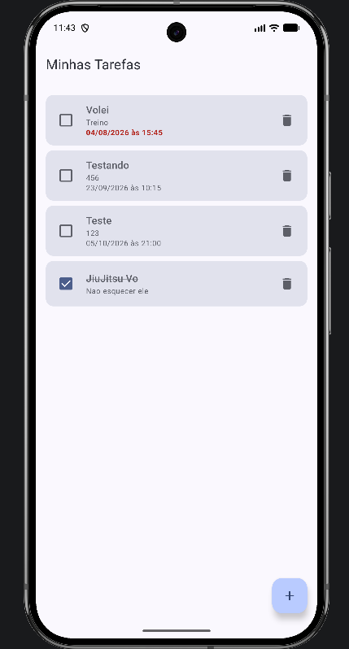
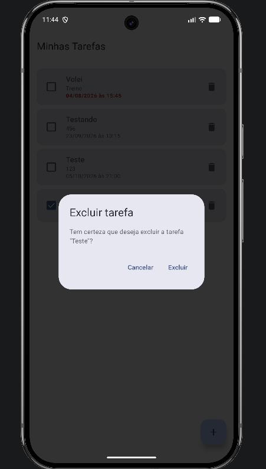
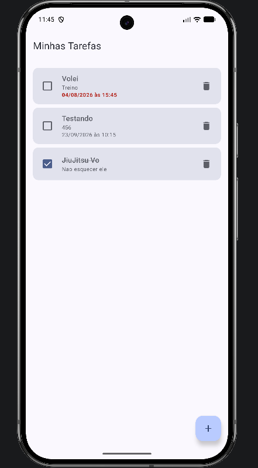

# Evidências da confirmação de exclusão

Este documento reúne as evidências de funcionamento do fluxo de confirmação anterior à exclusão de uma tarefa.

As capturas foram feitas durante a execução do aplicativo em um emulador Android (API 36) e apresentam, em sequência, o comportamento da funcionalidade. A tarefa utilizada na demonstração é **Teste**, com a descrição `123` e prazo definido para `05/10/2026 às 21:00`.

O diálogo é exibido sobre a própria tela de listagem, construído com `AlertDialog` do Material 3, conforme implementado em `ListaTarefasScreen.kt`.

---

## 1. Lista antes da exclusão

Estado inicial da listagem, com quatro tarefas cadastradas. Nenhuma operação de exclusão foi iniciada até este ponto.

---

## 2. Diálogo aberto com a tarefa selecionada

Ao tocar no ícone de lixeira da tarefa **Teste**, a lista não é alterada. Em vez disso, é exibido o diálogo de confirmação, que informa a operação e apresenta o título da tarefa selecionada entre aspas, além das ações **Cancelar** e **Excluir**.

---

## 3. Resultado ao cancelar

Ao acionar **Cancelar**, o diálogo é fechado e nenhuma alteração é aplicada. A tarefa **Teste** permanece na listagem, assim como as demais tarefas, seus prazos e seus estados de conclusão.

---

## 4. Nova abertura do diálogo

Ao tocar novamente no ícone de lixeira da mesma tarefa, o diálogo é exibido outra vez com o título correspondente. Isso demonstra que o cancelamento apenas limpa o estado de seleção, sem impedir uma nova tentativa.

---

## 5. Resultado após confirmar a exclusão

Ao acionar **Excluir**, a tarefa selecionada é removida do banco de dados, o diálogo é fechado e a listagem é atualizada automaticamente pelo fluxo reativo do Room. Apenas a tarefa **Teste** foi excluída: as tarefas **Volei**, **Testando** e **JiuJitsu Vo** permanecem na lista, preservando prazos, ordenação, destaque de tarefa atrasada e estado de conclusão.

---

## Observações sobre a implementação

- O estado do diálogo é mantido em `ListaTarefasContent` por `var tarefaParaExcluir by remember { mutableStateOf<Tarefa?>(null) }`. O ícone de lixeira apenas atribui a tarefa a esse estado, sem chamar a exclusão.
- A remoção só ocorre no `confirmButton`, que invoca `onDeletar(tarefa)` e em seguida limpa o estado. Como a tarefa é capturada individualmente, somente o registro selecionado é excluído.
- `onCancelar` é usado tanto pelo `dismissButton` quanto pelo `onDismissRequest`, de modo que fechar o diálogo tocando fora dele também não altera a lista.
- O arquivo contém a preview `ConfirmarExclusaoDialogPreview`, que permite visualizar o estado de confirmação de exclusão diretamente no Android Studio, sem executar o aplicativo.
