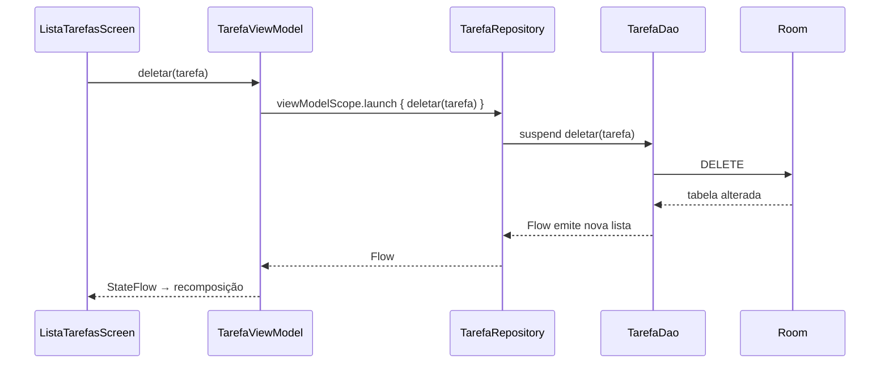
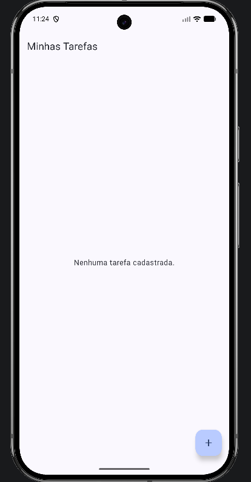
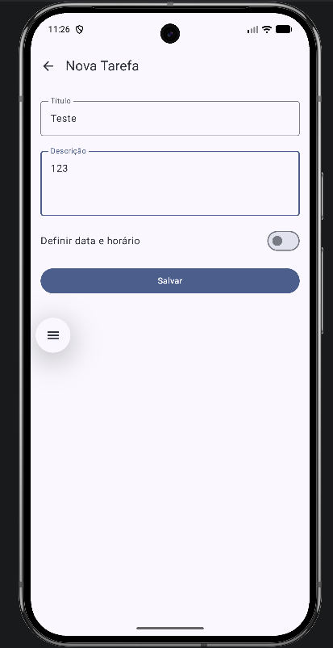
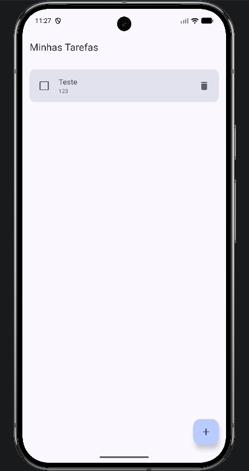
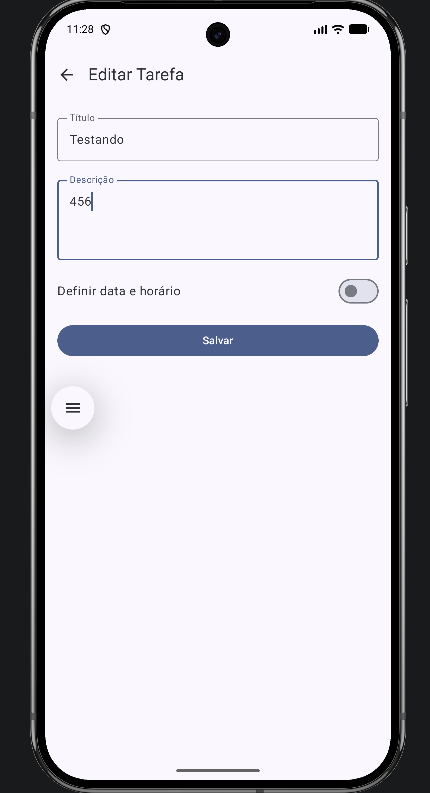
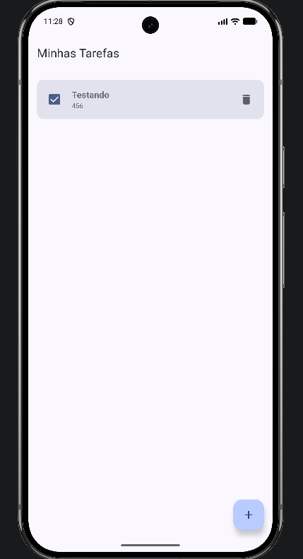
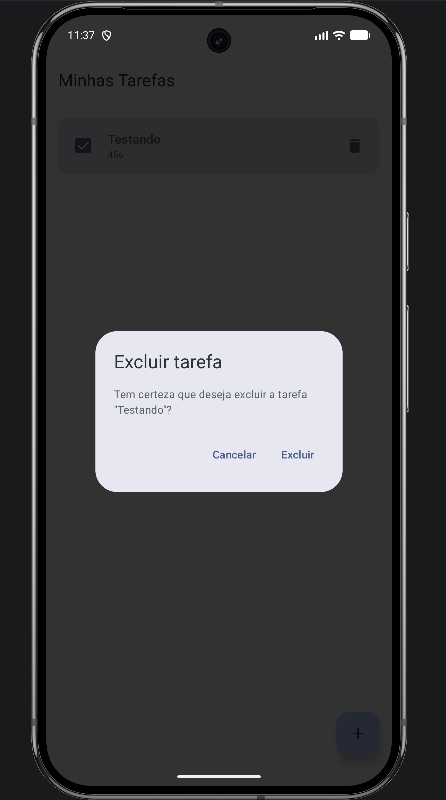

<h1 align="center">To-Do List</h1>

<p align="center">
  Aplicativo Android de tarefas com prazo, construído em Kotlin e Jetpack Compose.<br>
  Checkpoint da disciplina Android Kotlin Developer — FIAP.
</p>

<p align="center">
  
  
  
  
  
</p>

---

**Aluno:** Matheus Richard Hadermeck · **Turma:** 3SIR · **Professor:** Ewerton Luiz de Lima Carreira

---

## Índice

- [O que o aplicativo faz](#o-que-o-aplicativo-faz)
- [Entrega deste checkpoint: confirmar antes de excluir](#entrega-deste-checkpoint-confirmar-antes-de-excluir)
- [Prazos: a regra que organiza a lista](#prazos-a-regra-que-organiza-a-lista)
- [Como o dado circula pelas camadas](#como-o-dado-circula-pelas-camadas)
- [Decisões de implementação](#decisões-de-implementação)
- [Onde encontrar cada coisa](#onde-encontrar-cada-coisa)
- [Testes](#testes)
- [Rodando o projeto](#rodando-o-projeto)
- [Telas](#telas)
- [Linha do tempo do desenvolvimento](#linha-do-tempo-do-desenvolvimento)

## O que o aplicativo faz

Uma lista de tarefas que funciona inteiramente offline. Tudo que é salvo fica no aparelho, em um banco SQLite gerenciado pelo Room, e continua lá depois de fechar o app.

O ciclo de uso é curto:

```
lista vazia → [ + ] → formulário → salvar → tarefa na lista
                                                    │
                          ┌─────────────────────────┼──────────────────────┐
                          ▼                         ▼                      ▼
                    tocar no card             tocar no checkbox      tocar na lixeira
                          │                         │                      │
                      editar                  concluir/reabrir       confirmar → excluir
```

Cada tarefa tem título, descrição opcional e, se você quiser, um **prazo** com data e horário. O prazo é o que diferencia este projeto de uma lista comum: ele reordena a listagem e sinaliza o que já venceu.

| | |
|---|---|
| **Criar** | Título é obrigatório; descrição e prazo são opcionais. O botão Salvar fica desabilitado enquanto o título estiver vazio. |
| **Editar** | O mesmo formulário abre preenchido. O ID, a data de criação e o estado de conclusão são preservados. |
| **Concluir** | O checkbox risca o título e tira o destaque de atraso, mesmo que o prazo já tenha passado. |
| **Excluir** | Pede confirmação em um diálogo antes de remover. Detalhado na próxima seção. |

## Entrega deste checkpoint: confirmar antes de excluir

Antes, o ícone de lixeira apagava a tarefa na hora — um toque acidental era irreversível. Agora ele apenas **seleciona** a tarefa; quem apaga é a confirmação.

A tela da lista guarda um único campo de estado, que também funciona como a pergunta "há algo aguardando confirmação?":

```kotlin
var tarefaParaExcluir by remember { mutableStateOf<Tarefa?>(null) }
```

Enquanto esse campo for `null`, não há diálogo na tela. O ícone de lixeira faz uma coisa só — `tarefaParaExcluir = tarefa` — e a recomposição do Compose cuida do resto:

```kotlin
tarefaParaExcluir?.let { tarefa ->
    ConfirmarExclusaoDialog(
        tarefa = tarefa,
        onConfirmar = {
            onDeletar(tarefa)
            tarefaParaExcluir = null
        },
        onCancelar = { tarefaParaExcluir = null }
    )
}
```

O diálogo é um `AlertDialog` do Material 3 e repete o título da tarefa no corpo do texto, para que não reste dúvida sobre qual registro está prestes a sumir:

> **Excluir tarefa**
> Tem certeza que deseja excluir a tarefa "Teste"?
> `Cancelar`  `Excluir`

**O que cada saída faz:**

- `Excluir` → chama `onDeletar(tarefa)` com a tarefa que foi capturada no estado e depois limpa o campo. Como a referência é individual, nenhum outro registro é tocado.
- `Cancelar` → limpa o campo e nada mais. A lista, os prazos, a ordenação e os checkboxes ficam como estavam.
- Tocar fora do diálogo → `onDismissRequest` aponta para a mesma função de cancelar, então o fechamento acidental também é inofensivo.

Cancelar não bloqueia nada: como o estado volta a `null`, basta tocar na lixeira de novo para o diálogo reaparecer.

Tudo isso acontece **sobre a tela da lista**. Não existe rota nova, não existe tela de confirmação — `AppNavigation` continua com os mesmos dois destinos de antes.

A preview `ConfirmarExclusaoDialogPreview` permite abrir esse estado direto no Android Studio, sem emulador e sem banco.

📎 A sequência completa no emulador — lista, diálogo, cancelamento, reabertura e exclusão — está em **[EVIDENCIAS_EXCLUSAO.md](EVIDENCIAS_EXCLUSAO.md)**.

## Prazos: a regra que organiza a lista

O campo `dataHora` é anulável, e essa escolha se espalha pelo comportamento do app.

**A ordenação acontece no SQL, não no Kotlin**, em três níveis:

```sql
SELECT * FROM tarefas
ORDER BY dataHora IS NULL,   -- 1. quem tem prazo vem primeiro
         dataHora ASC,       -- 2. entre elas, o vencimento mais próximo lidera
         dataCriacao DESC    -- 3. as sem prazo, da mais recente para a mais antiga
```

O primeiro critério é o truque: no SQLite, `dataHora IS NULL` vale `0` para as tarefas com prazo e `1` para as sem prazo, então ordenar por ele empurra as datadas para o topo sem precisar de duas consultas.

**O atraso é calculado na hora de desenhar**, não armazenado:

```kotlin
val atrasada = tarefa.dataHora < System.currentTimeMillis() && !tarefa.concluida
```

Como o valor é derivado, não existe estado a sincronizar — uma tarefa vencida passa a aparecer em vermelho e negrito sozinha, e volta ao normal assim que é concluída.

## Como o dado circula pelas camadas

A arquitetura é MVVM com Repository. Nenhuma tela conhece o Room, e nenhuma escrita passa pela thread principal.



Repare que a seta de volta não é a resposta da chamada. A UI **não** atualiza a lista porque o `deletar` terminou; ela atualiza porque o Room avisou que a tabela mudou e o `Flow` emitiu de novo. Isso vale para qualquer alteração — inclusive uma feita de outra tela.

O `Flow` vira estado de Compose em dois passos:

1. `stateIn(viewModelScope, WhileSubscribed(5_000), emptyList())` na ViewModel — mantém a coleta viva por 5 segundos após o último observador, o que evita reconsultar o banco em uma rotação de tela.
2. `collectAsStateWithLifecycle()` na tela — amarra a coleta ao ciclo de vida, parando quando o app vai para segundo plano.

## Decisões de implementação

**Toda tela tem duas metades.** `ListaTarefasScreen` observa a ViewModel; `ListaTarefasContent` só recebe dados e lambdas. O mesmo vale para o formulário. A metade de baixo não sabe que existe ViewModel, Context ou banco — por isso as previews funcionam sem nenhum deles. São dez previews no projeto, cobrindo lista cheia, lista vazia, item pendente, item concluído, item com prazo futuro, item atrasado, confirmação de exclusão e os três modos do formulário.

**O `DatePicker` do Material 3 mente sobre o fuso.** Ele devolve a data escolhida como meia-noite em UTC, independente de onde o aparelho está. Usar esse valor direto faz a data "voltar um dia" no Brasil. `DataHoraUtil` isola essa conversão em funções puras — `extrairDataDoDatePicker`, `paraMillisUtcDoDatePicker` e `combinarDataHora` — que por serem puras puderam ser testadas sem subir a interface.

**A `ViewModelProvider.Factory` é o injetor de dependência do projeto.** Ela monta a cadeia `Context → TarefaDatabase → TarefaDao → TarefaRepository → TarefaViewModel` na mão. Para um app deste tamanho, isso resolve sem trazer Hilt ou Koin para a jogada.

**O Repository é fino de propósito.** Hoje ele só repassa chamadas ao DAO. O ganho não é o código de agora, é o ponto de costura: se um dia entrar API, cache ou alguma regra entre a tela e o banco, o lugar já existe e a ViewModel não muda.

**A migração do banco é destrutiva.** A entrada do campo `dataHora` levou o esquema para a versão 2, tratada com `fallbackToDestructiveMigration`. Em produção isso seria inaceitável; em um projeto acadêmico, recriar a tabela custa menos que escrever uma `Migration` para dados descartáveis.

**O ID `0` é a convenção de "ainda não existe".** A navegação usa `formulario/0` para cadastro e `formulario/{id}` para edição, então uma única rota e uma única tela atendem os dois modos.

## Onde encontrar cada coisa

```text
app/src/main/java/matsu_oficial/com/github/todolist/
├── MainActivity.kt                  ponto de entrada; monta a ViewModel e chama a navegação
├── navigation/AppNavigation.kt      rotas "lista" e "formulario/{tarefaId}"
├── data/
│   ├── Tarefa.kt                    @Entity da tabela "tarefas"
│   ├── TarefaDao.kt                 consultas e operações de escrita
│   └── TarefaDatabase.kt            banco Room v2, singleton com @Volatile
├── repository/TarefaRepository.kt   fronteira entre a ViewModel e o Room
├── viewmodel/TarefaViewModel.kt     StateFlow da lista + Factory de dependências
├── ui/
│   ├── ListaTarefasScreen.kt        listagem, item, diálogo de exclusão e previews
│   ├── FormularioTarefaScreen.kt    cadastro/edição, DatePicker e TimePicker
│   └── theme/                       cores, tipografia e tema Material 3
└── util/DataHoraUtil.kt             formatação e conversões de fuso

app/src/androidTest/                 testes do DAO (Room em memória) e de DataHoraUtil
docs/images/                         capturas de tela; a pasta exclusao/ tem as evidências do CP
```

### Stack

| Camada | Ferramentas |
|---|---|
| Interface | Jetpack Compose, Material 3, Compose Preview |
| Estado | ViewModel, StateFlow, `collectAsStateWithLifecycle` |
| Navegação | Navigation Compose |
| Persistência | Room (Entity, DAO, SQLite), KSP para geração de código |
| Concorrência | Coroutines (`suspend`, `viewModelScope`) |
| Build | Gradle 9.3.1, AGP 9.1.1, Kotlin 2.2.10, JDK 21, compileSdk/targetSdk 36, minSdk 24 |

## Testes

Os testes ficam em `app/src/androidTest` e rodam com um emulador ou aparelho conectado:

```powershell
.\gradlew.bat connectedAndroidTest
```

**`TarefaDaoTest`** sobe um banco Room **em memória** a cada teste e o fecha no fim, então nada encosta nos dados da instalação real:

| Teste | O que garante |
|---|---|
| `inserirTarefaEListar` | A tarefa gravada volta na consulta e nasce como não concluída. |
| `marcarTarefaComoConcluida` | O `@Update` persiste a mudança de estado. |
| `deletarTarefa` | O registro some da listagem após a remoção. |
| `tarefasComPrazoAparecemAntesDeAvulsasEOrdenadasPorProximidade` | A regra de ordenação de três níveis se comporta como o esperado. |

**`DataHoraUtilTest`** cobre a formatação `dd/MM/yyyy 'às' HH:mm` e verifica que as conversões de UTC do `DatePicker` são inversas uma da outra.

## Rodando o projeto

**Você vai precisar de:** Android Studio compatível com AGP 9.1.1, um JDK 21 completo, o Android SDK Platform 36 e um dispositivo ou emulador com API 24 ou superior.

Pelo Android Studio, abra a pasta que contém o `settings.gradle.kts`, espere a sincronização do Gradle, selecione o módulo `app` e clique em Run.

Pelo terminal:

```powershell
.\gradlew.bat assembleDebug        # Windows
```

```bash
./gradlew assembleDebug            # Linux / macOS
```

> **Se o build falhar com `jlink executable ... does not exist`:** o Gradle está usando um JRE em vez de um JDK. Aponte-o para um JDK 21 completo em `gradle.properties` — `org.gradle.java.home=C:/Program Files/Java/jdk-21.0.10` — ou selecione o JDK 21 em *Settings → Build Tools → Gradle*.

## Telas

<p align="center">
  
  
  
</p>
<p align="center">
  <em>Estado vazio · cadastro de uma nova tarefa · a tarefa salva aparecendo na lista</em>
</p>

<p align="center">
  
  
  
</p>
<p align="center">
  <em>Edição com os dados carregados · tarefa editada e concluída · confirmação antes de excluir</em>
</p>

## Linha do tempo do desenvolvimento

- [`88bcbb5`](https://github.com/matsu-oficial/cp5-todolist/commit/88bcbb522e713c437ed69f88073757cebb3ea60b) — projeto Android criado, com tema Material 3 e catálogo de versões
- [`c9beca8`](https://github.com/matsu-oficial/cp5-todolist/commit/c9beca839d44efe92987dbb506491ff8a63405a5) — entidade, DAO e banco Room: as tarefas passam a sobreviver ao fechamento do app
- [`6d036b7`](https://github.com/matsu-oficial/cp5-todolist/commit/6d036b7be4e43ee1f6de1d3122d3c53198111dba) — Repository e ViewModel entram entre a tela e o banco
- [`a9e7fb1`](https://github.com/matsu-oficial/cp5-todolist/commit/a9e7fb1743b37dcd7b1ad20de74d0f84ded3f180) — listagem com `LazyColumn`, estado vazio, conclusão e exclusão
- [`50ebe2c`](https://github.com/matsu-oficial/cp5-todolist/commit/50ebe2caf8f3d63ef53d5323bbfaadc59fa1c7ff) — um único formulário atendendo cadastro e edição
- [`29edd16`](https://github.com/matsu-oficial/cp5-todolist/commit/29edd16564af19b75920b168a7f7ba894350927b) — navegação ligada e a tela de exemplo do template aposentada
- [`da745c5`](https://github.com/matsu-oficial/cp5-todolist/commit/da745c503983bebc5f8306e2d9f7989cfe4ba1ab) — primeiros testes instrumentados do DAO
- [`5cc09b0`](https://github.com/matsu-oficial/cp5-todolist/commit/5cc09b0bc9e9774f75bfe58c36761b9e03931380) — prazos: campo `dataHora`, seletores, ordenação por vencimento e destaque de atraso
- [`48cf67c`](https://github.com/matsu-oficial/cp5-todolist/commit/48cf67c9e783709059ba013e097e1b20c7a3fca9) — **entrega do checkpoint:** diálogo de confirmação antes da exclusão
