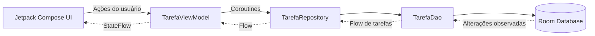

# FIAP To-Do List

> Trabalho acadêmico desenvolvido para a disciplina **Android Kotlin Developer** da FIAP.

| Informação | Detalhe |
|---|---|
| **Aluno** | Matheus Richard Hadermeck |
| **Turma** | 3SIR - FIAP |
| **Instituição** | FIAP |
| **Professor** | Ewerton Luiz de Lima Carreira |
| **Disciplina** | Android Kotlin Developer |

## Sobre o projeto

O **FIAP To-Do List** é um aplicativo Android nativo para gerenciamento de tarefas pessoais. A aplicação permite cadastrar tarefas, definir um prazo com data e horário, visualizar os registros salvos, editar título, descrição e prazo, marcar itens como concluídos e excluir tarefas mediante confirmação. Os dados são armazenados localmente com Room, portanto permanecem disponíveis após o fechamento do aplicativo e não dependem de conexão com a internet.

Além das operações de CRUD, o projeto foi desenvolvido para aplicar uma organização baseada em **MVVM com Repository**, mantendo interface, gerenciamento de estado e persistência em camadas com responsabilidades distintas. A interface foi construída de forma declarativa com Jetpack Compose e reage automaticamente às alterações do banco por meio de Flow e StateFlow.

## Escopo implementado

| Etapa | Commit de referência | Implementação |
|---|---|---|
| Estrutura inicial | [`88bcbb5`](https://github.com/matsu-oficial/cp5-todolist/commit/88bcbb522e713c437ed69f88073757cebb3ea60b) | Configuração do módulo, do catálogo de versões, do tema Material 3 e dos recursos do aplicativo. |
| Camada de dados | [`c9beca8`](https://github.com/matsu-oficial/cp5-todolist/commit/c9beca839d44efe92987dbb506491ff8a63405a5) | Criação de `Tarefa`, `TarefaDao` e `TarefaDatabase` para persistência local com Room. |
| Repository e ViewModel | [`6d036b7`](https://github.com/matsu-oficial/cp5-todolist/commit/6d036b7be4e43ee1f6de1d3122d3c53198111dba) | Criação de `TarefaRepository` e `TarefaViewModel`, com exposição do estado e operações de inserção, atualização e exclusão. |
| Tela de listagem | [`a9e7fb1`](https://github.com/matsu-oficial/cp5-todolist/commit/a9e7fb1743b37dcd7b1ad20de74d0f84ded3f180) | Criação de `ListaTarefasScreen` com `LazyColumn`, estado vazio, conclusão, edição, exclusão, cadastro e previews. |
| Formulário | [`50ebe2c`](https://github.com/matsu-oficial/cp5-todolist/commit/50ebe2caf8f3d63ef53d5323bbfaadc59fa1c7ff) | Criação de `FormularioTarefaScreen` para atender cadastro e edição, com preenchimento dos dados existentes e previews. |
| Navegação | [`29edd16`](https://github.com/matsu-oficial/cp5-todolist/commit/29edd16564af19b75920b168a7f7ba894350927b) | Configuração de `AppNavigation` com as rotas da lista e do formulário e inicialização do fluxo na `MainActivity`. |
| Testes do DAO | [`da745c5`](https://github.com/matsu-oficial/cp5-todolist/commit/da745c503983bebc5f8306e2d9f7989cfe4ba1ab) | Testes instrumentados de inserção, conclusão e exclusão sobre um banco Room em memória. |
| Data e horário | [`5cc09b0`](https://github.com/matsu-oficial/cp5-todolist/commit/5cc09b0bc9e9774f75bfe58c36761b9e03931380) | Inclusão do campo `dataHora`, seletores de data e hora no formulário, ordenação por prazo e destaque de tarefas atrasadas. |
| Confirmação de exclusão | [`48cf67c`](https://github.com/matsu-oficial/cp5-todolist/commit/48cf67c9e783709059ba013e097e1b20c7a3fca9) | Inclusão do diálogo de confirmação antes da exclusão definitiva, com preview do estado de confirmação. |

### Funcionalidades disponíveis

- cadastro de tarefa com título obrigatório e descrição opcional;
- definição opcional de prazo, com seleção de data e de horário;
- listagem reativa das tarefas, com as que possuem prazo exibidas primeiro e ordenadas pela proximidade do vencimento;
- destaque visual das tarefas atrasadas e ainda não concluídas;
- edição do título, da descrição e do prazo de uma tarefa existente;
- marcação e desmarcação de uma tarefa como concluída;
- exclusão de tarefas precedida por diálogo de confirmação;
- persistência local com Room;
- navegação entre lista e formulário;
- estado visual para lista vazia;
- previews dos principais estados das telas e componentes.

## Confirmação antes da exclusão

O toque no ícone de lixeira não remove mais a tarefa de imediato. A ação passa a apenas registrar qual tarefa foi selecionada, e a exclusão só acontece depois de confirmada pelo usuário.

O estado é mantido dentro de `ListaTarefasContent`:

```kotlin
var tarefaParaExcluir by remember { mutableStateOf<Tarefa?>(null) }
```

Enquanto esse estado for `null`, nenhum diálogo é exibido. Quando o ícone de lixeira de um item é acionado, a tarefa correspondente é atribuída ao estado e o Compose recompõe a tela exibindo `ConfirmarExclusaoDialog` sobre a listagem:

```kotlin
tarefaParaExcluir?.let { tarefa ->
    ConfirmarExclusaoDialog(
        tarefa = tarefa,
        onConfirmar = {
            onDeletar(tarefa)
            tarefaParaExcluir = null
        },
        onCancelar = {
            tarefaParaExcluir = null
        }
    )
}
```

O diálogo é construído com `AlertDialog` do Material 3 e apresenta o título da tarefa selecionada no corpo da mensagem. Suas ações se comportam da seguinte forma:

| Ação | Efeito |
|---|---|
| **Cancelar** | Limpa o estado, fecha o diálogo e mantém a lista exatamente como estava. |
| **Excluir** | Chama `onDeletar(tarefa)`, que remove apenas a tarefa selecionada, e em seguida fecha o diálogo. |
| Toque fora do diálogo | `onDismissRequest` executa a mesma ação de cancelamento, sem alterar a lista. |

Como a tarefa é capturada individualmente no estado, a operação nunca afeta outros registros. Os demais comportamentos do aplicativo, como cadastro, edição, conclusão, prazos, ordenação e indicação de tarefas atrasadas, permanecem inalterados.

A confirmação ocorre sobre a própria tela de listagem, por meio de um diálogo, sem a criação de uma nova rota ou tela.

As evidências da execução dessa funcionalidade no emulador estão reunidas em [EVIDENCIAS_EXCLUSAO.md](EVIDENCIAS_EXCLUSAO.md).

## Tecnologias utilizadas

| Tecnologia | Utilização no projeto |
|---|---|
| **Kotlin** | Linguagem principal utilizada para implementar as camadas de dados, estado, navegação e interface. |
| **Jetpack Compose** | Construção declarativa da interface, utilizando componentes como `Scaffold`, `LazyColumn`, `Card`, `Checkbox`, `OutlinedTextField` e `FloatingActionButton`. |
| **Material 3** | Componentes visuais e estrutura de tema utilizados pelas telas, incluindo `AlertDialog`, `DatePicker` e `TimePicker`. |
| **Room** | Persistência local das tarefas por meio de Entity, DAO e banco de dados SQLite abstraído pela biblioteca. |
| **Coroutines** | Execução assíncrona das operações suspensas de inserção, atualização e exclusão sem bloquear a interface. |
| **Flow e StateFlow** | Propagação reativa da lista de tarefas desde o DAO até a interface. |
| **ViewModel** | Manutenção do estado da tela e coordenação das ações da interface durante o ciclo de vida da Activity. |
| **Navigation Compose** | Definição das rotas e navegação entre a listagem e o formulário de cadastro ou edição. |
| **KSP** | Processamento das anotações do Room e geração do código necessário para acesso ao banco. |
| **Compose Preview** | Visualização isolada dos estados da interface diretamente no Android Studio. |

### Configuração técnica do projeto

- **Android Gradle Plugin:** 9.1.1
- **Gradle Wrapper:** 9.3.1
- **Kotlin:** 2.2.10
- **KSP:** 2.3.2
- **Java/JVM:** 21
- **Compile SDK:** 36
- **Target SDK:** 36
- **Minimum SDK:** 24
- **Compose BOM:** 2026.02.01
- **Room:** 2.7.1
- **Navigation Compose:** 2.9.0

## Arquitetura

O aplicativo segue o padrão **MVVM com Repository**. A organização evita que as telas acessem diretamente o banco de dados e estabelece um fluxo previsível para leitura e alteração das tarefas.



O fluxo ocorre em duas direções complementares:

1. **Ações:** a interface encaminha eventos para a ViewModel, que inicia uma coroutine e solicita a operação ao Repository. O Repository delega a chamada ao DAO, que altera o banco Room.
2. **Estado:** quando a tabela é alterada, a consulta observável do DAO emite uma nova lista por `Flow`. A ViewModel converte esse fluxo em `StateFlow`, e as telas coletam o estado de forma compatível com o ciclo de vida. O Compose então recompõe apenas os elementos afetados.

Essa abordagem mantém um fluxo unidirecional de estado: a interface exibe dados recebidos da ViewModel e devolve somente ações do usuário, sem controlar diretamente a persistência.

## Estrutura principal

```text
app/src/main/java/matsu_oficial/com/github/todolist/
├── data/
│   ├── Tarefa.kt
│   ├── TarefaDao.kt
│   └── TarefaDatabase.kt
├── repository/
│   └── TarefaRepository.kt
├── viewmodel/
│   └── TarefaViewModel.kt
├── ui/
│   ├── ListaTarefasScreen.kt
│   ├── FormularioTarefaScreen.kt
│   └── theme/
├── util/
│   └── DataHoraUtil.kt
├── navigation/
│   └── AppNavigation.kt
└── MainActivity.kt

docs/
└── images/
    ├── exclusao/
    │   ├── 1-lista-antes-da-exclusao.png
    │   ├── 2-dialogo-aberto.png
    │   ├── 3-resultado-ao-cancelar.png
    │   ├── 4-nova-abertura-do-dialogo.png
    │   └── 5-resultado-apos-exclusao.png
    ├── tela-inicial.png
    ├── tela-registro.png
    ├── tela-lista-tarefas.png
    ├── tela-edicao.png
    ├── tela-lista-tarefa-editada.png
    └── tela-exclusao-tarefa.png
```

## Camada de dados

### `Tarefa`

`Tarefa.kt` representa a entidade persistida na tabela `tarefas`. Cada registro contém:

- `id`: chave primária inteira gerada automaticamente;
- `titulo`: nome da tarefa;
- `descricao`: detalhamento da tarefa;
- `concluida`: estado de conclusão, iniciado como `false`;
- `dataCriacao`: instante de criação, utilizado como critério de desempate na ordenação;
- `dataHora`: prazo opcional da tarefa, representado em milissegundos ou `null` quando a tarefa não possui prazo.

O valor `0` do ID também é usado pela navegação como convenção para representar uma tarefa ainda não cadastrada.

### `TarefaDao`

`TarefaDao.kt` define o contrato de acesso ao banco:

- `listarTodas()` retorna `Flow<List<Tarefa>>` ordenado por `dataHora IS NULL, dataHora ASC, dataCriacao DESC`, de modo que as tarefas com prazo aparecem primeiro, da mais próxima para a mais distante, e as tarefas sem prazo vêm em seguida, da mais recente para a mais antiga;
- `inserir()` adiciona uma nova tarefa;
- `atualizar()` persiste mudanças em uma tarefa existente;
- `deletar()` remove o registro informado.

As operações de escrita são funções `suspend`, permitindo que sejam executadas por coroutines fora do fluxo principal da interface.

### `TarefaDatabase`

`TarefaDatabase.kt` configura o banco Room na versão 2 e fornece o `TarefaDao`. A instância é criada com o nome `tarefas.db`. O `companion object` utiliza `@Volatile` e `synchronized` como estratégia de acesso compartilhado, centralizando a obtenção do banco durante a execução da aplicação.

A versão 2 corresponde à inclusão do campo `dataHora`. Como se trata de um projeto acadêmico, a evolução do esquema é tratada com `fallbackToDestructiveMigration`, que recria as tabelas em vez de exigir uma migração manual.

### `DataHoraUtil`

`DataHoraUtil.kt` concentra as conversões relacionadas ao prazo:

- `formatarDataHora` apresenta o prazo no formato brasileiro `dd/MM/yyyy 'às' HH:mm`;
- `extrairDataDoDatePicker` e `paraMillisUtcDoDatePicker` tratam a particularidade do `DatePicker` do Material 3, que representa a data escolhida em milissegundos UTC;
- `combinarDataHora` une a data e o horário selecionados em um único valor no fuso do dispositivo.

Isolar essas conversões em funções puras permite testá-las sem executar a interface.

## Responsabilidade de `TarefaRepository`

`TarefaRepository` é a camada intermediária entre a ViewModel e o DAO. Sua responsabilidade é fornecer uma API de dados para o restante da aplicação sem expor diretamente os detalhes de implementação do Room.

No estado atual, o Repository é propositalmente simples:

- recebe `TarefaDao` pelo construtor;
- expõe `tarefas: Flow<List<Tarefa>>`, originado pela consulta do DAO;
- delega `inserir`, `atualizar` e `deletar` para o DAO.

Mesmo sendo uma camada fina, essa separação reduz o acoplamento da `TarefaViewModel` com o Room. Caso a fonte de dados mude ou passe a combinar banco local, API, cache ou regras adicionais, essas alterações podem ser concentradas no Repository sem modificar diretamente a interface.

## Responsabilidade de `TarefaViewModel`

`TarefaViewModel` funciona como detentora do estado da interface e como ponto de entrada para as ações relacionadas às tarefas. Ela recebe o `TarefaRepository`, mas não acessa o DAO ou o banco diretamente.

A propriedade `tarefas` é exposta como `StateFlow<List<Tarefa>>`. Para isso, o `Flow` do Repository é convertido por `stateIn` com:

- `viewModelScope` como escopo da coleta;
- `SharingStarted.WhileSubscribed(5_000)` para manter o fluxo ativo durante um curto período após o último observador;
- `emptyList()` como estado inicial enquanto o Room ainda não emitiu a primeira lista.

Os métodos `inserir`, `atualizar` e `deletar` iniciam operações dentro de `viewModelScope.launch`. Dessa forma, as chamadas suspensas do Repository são executadas sem bloquear a thread principal e são canceladas automaticamente quando a ViewModel é descartada.

A ViewModel também fornece uma `ViewModelProvider.Factory`. Essa Factory monta manualmente as dependências na seguinte ordem:

```text
Context → TarefaDatabase → TarefaDao → TarefaRepository → TarefaViewModel
```

Esse mecanismo substitui a necessidade de um framework de injeção de dependência e garante que a ViewModel seja criada pelo sistema com o ciclo de vida correto.

## Como `ListaTarefasScreen` observa o estado e dispara ações

`ListaTarefasScreen` é o Composable conectado à `TarefaViewModel`. A lista é observada por meio de:

```kotlin
val tarefas by viewModel.tarefas.collectAsStateWithLifecycle()
```

`collectAsStateWithLifecycle()` transforma o `StateFlow` em estado do Compose e mantém a coleta associada ao ciclo de vida da tela. Sempre que o Room emitir uma lista atualizada, o Compose recebe o novo valor e recompõe a interface.

A tela conectada delega a renderização para `ListaTarefasContent`, passando a lista e callbacks. Essa separação cria dois níveis:

- **`ListaTarefasScreen`**: componente stateful, responsável por observar a ViewModel e encaminhar ações;
- **`ListaTarefasContent`**: componente orientado por parâmetros, responsável apenas por desenhar o estado recebido e emitir eventos pelas lambdas.

As principais ações são disparadas assim:

- o botão flutuante executa `onNovaTarefa`;
- o toque no card executa `onEditarTarefa(tarefa.id)`;
- o checkbox cria uma cópia com o novo valor de `concluida` e chama `viewModel.atualizar(...)`;
- o ícone de lixeira registra a tarefa em `tarefaParaExcluir`, abrindo o diálogo de confirmação.

Cada item exibe o prazo quando ele existe. Se o prazo já passou e a tarefa ainda não foi concluída, o texto é apresentado na cor de erro do tema e em negrito, sinalizando o atraso.

Quando existem tarefas, elas são exibidas por uma `LazyColumn`, que renderiza somente os itens necessários e usa o ID como chave estável. Quando a lista está vazia, a tela apresenta a mensagem `Nenhuma tarefa cadastrada.`.

A divisão entre Screen e Content também viabiliza os previews sem precisar instanciar uma ViewModel ou um banco real. O arquivo contém previews para lista preenchida, lista vazia, item pendente, item concluído, item com prazo futuro, item atrasado e confirmação de exclusão.

## Como `FormularioTarefaScreen` diferencia cadastro e edição

`FormularioTarefaScreen` recebe `tarefaId` pela navegação e usa o valor para determinar o modo de funcionamento:

- `tarefaId == 0`: modo de cadastro;
- `tarefaId != 0`: modo de edição.

A tela também observa `viewModel.tarefas` com `collectAsStateWithLifecycle()` e procura a tarefa correspondente ao ID recebido:

```kotlin
val tarefaExistente = remember(tarefas, tarefaId) {
    tarefas.find { it.id == tarefaId }
}
```

No cadastro, os campos começam vazios e, ao salvar, é criada uma nova instância de `Tarefa`. Na edição, título, descrição e prazo são preenchidos com os dados existentes. O salvamento utiliza `tarefaExistente.copy(...)`, alterando somente os campos editáveis e preservando o ID, a situação de conclusão e a data de criação.

O prazo é opcional e controlado por um `Switch`. Quando ativado, são exibidos dois botões que abrem, respectivamente, o `DatePicker` e o `TimePicker` do Material 3. O botão Salvar permanece desabilitado enquanto o título estiver em branco ou enquanto o prazo estiver ativado sem data e horário definidos.

Após uma inserção ou atualização, `onVoltar()` é chamado para retornar à listagem. A seta da barra superior também executa `onVoltar()`, mas sem salvar alterações.

Assim como na listagem, a separação entre `FormularioTarefaScreen` e `FormularioTarefaContent` permite previews independentes para cadastro, edição sem prazo e edição com prazo definido.

## Rotas configuradas em `AppNavigation`

`AppNavigation` cria e mantém um `NavController` com `rememberNavController()` e configura um `NavHost` cuja tela inicial é a lista.

| Rota | Destino | Comportamento |
|---|---|---|
| `lista` | `ListaTarefasScreen` | Exibe as tarefas e oferece ações para criar ou editar. |
| `formulario/{tarefaId}` | `FormularioTarefaScreen` | Abre o formulário e entrega o identificador recebido no caminho. |
| `formulario/0` | `FormularioTarefaScreen` | Representa o cadastro de uma nova tarefa. |
| `formulario/<id>` | `FormularioTarefaScreen` | Representa a edição da tarefa cujo ID foi informado. |

Ao selecionar **Nova tarefa**, a aplicação navega para `formulario/0`. Ao tocar em uma tarefa existente, monta a rota `formulario/$id`.

No destino do formulário, o valor de `tarefaId` é lido de `backStackEntry.arguments`, convertido para `Int` e enviado para `FormularioTarefaScreen`. O retorno é feito com `navController.popBackStack()`, removendo o formulário da pilha e reapresentando a lista.

A mesma instância de `TarefaViewModel` é repassada às duas rotas. Com isso, lista e formulário compartilham o mesmo estado e as alterações persistidas são refletidas na listagem quando o usuário retorna.

## Como a `MainActivity` inicia a aplicação

`MainActivity` é o ponto de entrada do aplicativo e atua como raiz de composição das dependências. Em `onCreate`, ela:

1. habilita o desenho edge-to-edge;
2. inicia a árvore Compose com `setContent`;
3. aplica o tema `FiaptodolistTheme`;
4. solicita a criação de `TarefaViewModel` por meio de `viewModel(factory = ...)`;
5. passa a ViewModel para `AppNavigation`.

A Factory recebe `applicationContext`, recupera a instância singleton de `TarefaDatabase`, obtém o DAO, cria o Repository e, por fim, cria a ViewModel. O uso da função `viewModel()` associa essa instância ao ciclo de vida da Activity e evita recriá-la a cada recomposição.

## Previews e separação entre estado e apresentação

As telas que dependem de ViewModel foram separadas entre uma função conectada ao estado e uma função de conteúdo. Essa decisão evita a tentativa de criar banco, Context ou ViewModel durante um Preview.

```text
Screen conectada → observa ViewModel e configura callbacks
Content          → recebe dados simples, desenha a UI e pode ser exibida em @Preview
```

Esse padrão melhora a testabilidade visual, reduz o acoplamento dos componentes de apresentação e permite visualizar diferentes cenários no Android Studio sem executar o aplicativo.

## Testes presentes no projeto

O projeto contém testes instrumentados para o `TarefaDao`, executados sobre um banco Room em memória. Os cenários cobertos verificam:

- inserção e leitura de uma tarefa;
- atualização do estado para concluída;
- exclusão de uma tarefa;
- ordenação da listagem, confirmando que tarefas com prazo aparecem antes das tarefas sem prazo e que as com prazo são ordenadas pela proximidade do vencimento.

Há também testes para as funções de `DataHoraUtil`, que validam o formato brasileiro de apresentação e a conversão entre a representação UTC do `DatePicker` e os valores de ano, mês e dia.

Como o banco é criado em memória durante cada teste e fechado ao final, os testes não alteram os dados da instalação real do aplicativo.

## Como executar

### Pré-requisitos

- Android Studio compatível com o Android Gradle Plugin 9.1.1;
- JDK 21 configurado no Gradle;
- Android SDK Platform 36 instalado;
- emulador ou dispositivo Android com API 24 ou superior.

### Pelo Android Studio

1. Faça o clone ou download deste repositório.
2. Abra no Android Studio a pasta raiz que contém `settings.gradle.kts`.
3. Aguarde a sincronização do Gradle e a instalação das dependências.
4. Confirme que o Gradle está configurado para utilizar o JDK 21.
5. Crie ou inicie um emulador Android, ou conecte um dispositivo físico com depuração USB habilitada.
6. Selecione a configuração do módulo `app`.
7. Clique em **Run** para compilar, instalar e abrir a aplicação.

### Compilação pelo terminal

No Windows:

```powershell
.\gradlew.bat assembleDebug
```

No Linux ou macOS:

```bash
chmod +x gradlew
./gradlew assembleDebug
```

Para executar os testes instrumentados, mantenha um emulador ou dispositivo conectado e utilize:

```powershell
.\gradlew.bat connectedAndroidTest
```

## Evidências

As imagens abaixo estão armazenadas em `docs/images` e registram os principais estados validados durante a atividade. A sequência completa da confirmação de exclusão está em [EVIDENCIAS_EXCLUSAO.md](EVIDENCIAS_EXCLUSAO.md).

### Tela inicial e cadastro

| Estado inicial sem tarefas | Formulário de nova tarefa |
|---|---|
|  |  |

A primeira evidência demonstra o estado vazio da `ListaTarefasScreen`. A segunda apresenta o formulário em modo de cadastro, com título e descrição preenchidos e o prazo desativado.

### Tarefa cadastrada, editada e concluída

| Registro salvo na listagem | Formulário em modo de edição | Tarefa editada e concluída |
|---|---|---|
|  |  |  |

Essas evidências demonstram o fluxo de gerenciamento da tarefa: o registro é apresentado na listagem após o cadastro, suas informações podem ser alteradas pelo formulário em modo de edição e seu estado pode ser atualizado para concluído por meio do checkbox. As alterações persistidas são refletidas na interface a partir do estado observado pela aplicação.

### Confirmação de exclusão

<p align="center">
  
</p>

O diálogo é exibido sobre a tela da lista e apresenta o título da tarefa selecionada, deixando explícito qual registro será removido caso a operação seja confirmada.
